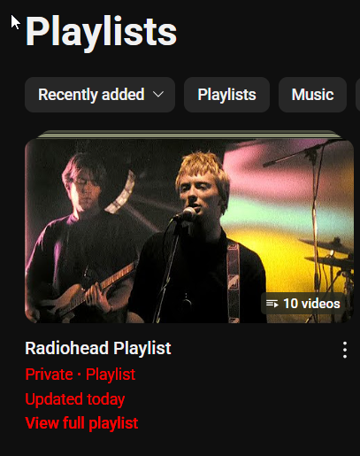

# youtube-playlist-automation

This Python script automates the creation of a YouTube playlist and adds it with videos based on a user-provided search term. It utilizes the YouTube Data API to search for videos and manage playlists.

---

## Features

- Search for videos on YouTube using a custom query.
- Create a new private playlist.
- Add the top 10 search results to the newly created playlist.

## Prerequisites

This project requires Python and the `google-auth`, `google-auth-oauthlib`, and `google-api-python-client` packages installed

## Setup

1. Google Cloud Console

a. Create a project on the Google Cloud Console.
b. Enable the YouTube Data API v3 for your project.
c. Create OAuth 2.0 credentials for a Desktop app.
d. Download the client secrets file (client_secrets.json) and place it in the same directory as the script.

2. Clone the repo
 `https://github.com/umutulay/youtube_auto_playlist_create_by_search.git`

3. Install pyhton packages
 `pip install -r requirements.txt`

## Usage

Run the script from the command line. You will be prompted to enter a search input (e.g., radiohead cover)

`python youtube_playlist_creater.py`

## Authors
* Umut Tulay - [umutulay](https://github.com/umutulay)
